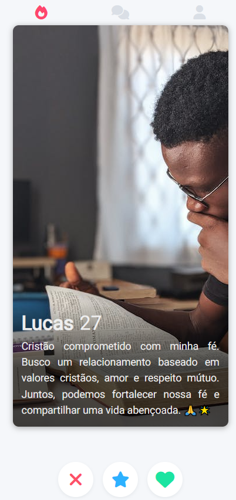

# Clone do Tinder (Front-End)

Bem-vindo ao projeto do Clone do Tinder!

## Demonstração do Projeto

Assista a uma breve demonstração do projeto no vídeo abaixo:

[!(https://drive.google.com/file/d/1OzKkyfSTtyG22kGFUmwBw50dSvsWTlHX/view?usp=sharing)]

## Descrição

Este projeto é um clone do Tinder, um popular aplicativo de encontros, desenvolvido como parte do curso de Desenvolvimento Web da ímã. O objetivo principal é aplicar conceitos essenciais de desenvolvimento web, como HTML, CSS e JavaScript, para criar uma interface de usuário atraente e responsiva.

Durante o desenvolvimento deste projeto, você terá a oportunidade de praticar suas habilidades de front-end e aprender conceitos importantes, como estruturação de páginas web, estilização usando CSS, manipulação do DOM com JavaScript e implementação de interações e funcionalidades básicas.

## Benefícios do Projeto

Ao trabalhar neste projeto, você poderá desfrutar dos seguintes benefícios:

1. Aprendizado prático de conceitos de front-end.
2. Desenvolvimento de habilidades em HTML, CSS e JavaScript.
3. Experiência na construção de interfaces de usuário atraentes e responsivas.
4. Preparação para desafios futuros no desenvolvimento web.

Este projeto é uma oportunidade valiosa para consolidar seus conhecimentos em desenvolvimento web e criar um projeto realista e relevante para o mercado.

## Funcionalidades

O Clone do Tinder possui as seguintes funcionalidades básicas:

1. Exibição de perfis de usuários com informações como nome, idade, biografia e foto.
2. Opção para descartar um perfil, indicando desinteresse.
3. Opção para curtir um perfil, demonstrando interesse.
4. Opção para dar um super like em um perfil, mostrando um interesse especial.

## Tecnologias Utilizadas

O projeto utiliza as seguintes tecnologias:

- HTML: para estruturar a página.
- CSS: para estilizar a interface.
- JavaScript: para adicionar interatividade e funcionalidades.

## Como Executar o Projeto

Para executar o projeto localmente, siga as etapas abaixo:

1. Clone este repositório para o seu computador ou faça o download dos arquivos.

2. Abra o arquivo `index.html` em um navegador da web.

3. Interaja com a interface clicando nos botões de descartar, curtir ou super like para navegar pelos perfis exibidos.

4. Explore o código-fonte para entender como as diferentes partes do projeto foram implementadas.

## Fonte das Fotos

As fotos utilizadas neste projeto foram obtidas a partir do site Pexels. O Pexels oferece uma ampla seleção de imagens gratuitas de alta qualidade, licenciadas para uso comercial e sem a necessidade de atribuição.

Você pode encontrar as fotos utilizadas no projeto nos seguintes links:

- [gabriel.jpeg](https://www.pexels.com/pt-br/foto/paulo-roberto-15024050/)
- [isabela.jpeg](https://www.pexels.com/pt-br/foto/oculos-grama-cabelo-longo-cabelo-comprido-17428614/)
- [laura.jpeg](https://www.pexels.com/photo/woman-in-grey-sleeveless-top-leaning-on-wall-1375849/)
- [lucas.jpeg](https://www.pexels.com/pt-br/foto/homem-lendo-um-livro-3118214/)

Agradecemos ao Pexels pela disponibilização dessas imagens de forma gratuita.

## Contribuição

Contribuições são bem-vindas! Sinta-se à vontade para enviar pull requests com melhorias, correções de bugs ou novas funcionalidades para este projeto.

## Licença

Este projeto está licenciado sob a [MIT License](LICENSE).

Aproveite esta oportunidade de aprender e desenvolver suas habilidades em desenvolvimento web. Divirta-se criando o seu próprio Clone do Tinder e explore as possibilidades de criação de interfaces atraentes e responsivas.
